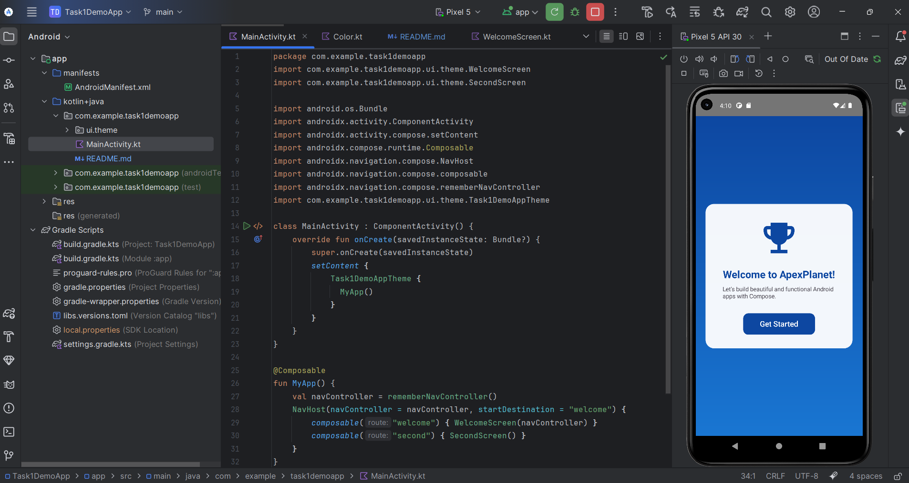

# Task1DemoApp

A simple Android app built with **Jetpack Compose** showcasing basic UI and layout using Compose components.

## Features

- Uses modern **Jetpack Compose** for UI
- Displays a greeting message on the screen
- Applies custom app theme using Material3
- Demonstrates basic app setup with `ComponentActivity` and `setContent`

## Screenshots

## Getting Started

### Prerequisites

- Android Studio Dolphin or later (Arctic Fox+ recommended)
- Kotlin 1.9.20 (compatible with Compose Compiler 1.5.4)
- Minimum SDK version: (specify your minSdkVersion, e.g., 21)

### How to Run

1. Clone this repository:

   ```bash
   git clone https://github.com/your-username/Task1DemoApp.git
   ```

2. Open the project in Android Studio.

3. Sync Gradle and wait for the project to build.

4. Run the app on an emulator or physical device.

## Project Structure

- `MainActivity.kt` — main entry point and Compose UI setup
- `ui.theme/` — theme definitions and styling
- `AndroidManifest.xml` — app manifest with activity declarations
- `build.gradle` — project and module build configuration

## Dependencies

- Jetpack Compose 1.5.4
- Kotlin 1.9.20
- Material3

## Known Issues

- Ensure Kotlin and Compose Compiler versions are compatible as per [Compose-Kotlin Compatibility Map](https://developer.android.com/jetpack/androidx/releases/compose-kotlin).

## License

This project is open source and available under the MIT License.

--------------------------------------------------------------------------------------------


## Task 2: Designing and Implementing UI/UX

### Overview
In Task 2, I focused on designing and implementing the user interface (UI) and user experience (UX) of the Android app using Jetpack Compose. The goal was to create a clean, responsive, and user-friendly interface that aligns with modern design principles.

### What I did
- Created wireframes and mockups for the app screens to plan layout and styling.
- Implemented UI components such as Buttons, TextFields, and Navigation using Jetpack Compose.
- Applied themes and colors to improve app appearance and maintain consistency.
- Ensured the app is responsive and works well on different screen sizes.
- Developed two main screens:
   - **Welcome Screen:** A welcome message with gradient background, icon, and a navigation button.
   - **Second Screen:** A simple screen showing text content with styled surface and layout.

### Screenshots

Welcome Screen:



Second Screen:


### Challenges & Learnings
- Learned to use Jetpack Compose for modern Android UI development.
- Understood the importance of theming and styling for better UX.
- Practiced navigation between screens using Compose Navigation.
- Improved my UI/UX design skills by integrating wireframes into real code.

---

